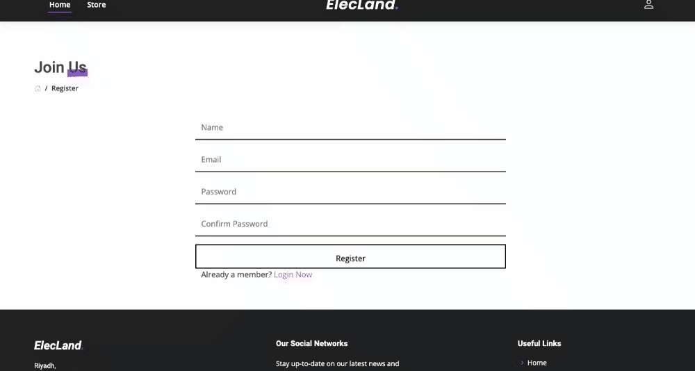
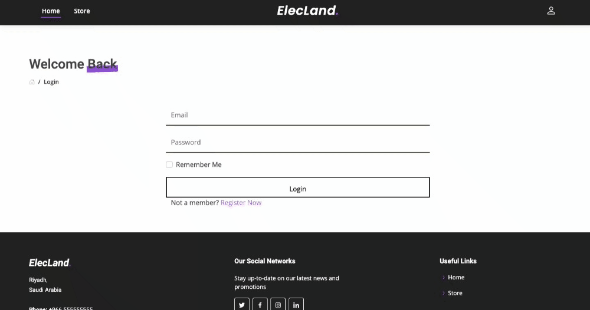
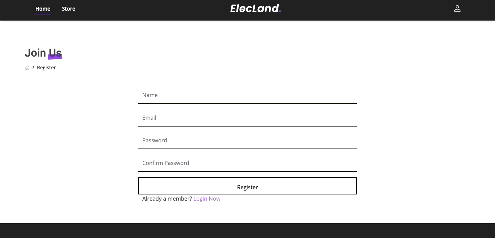
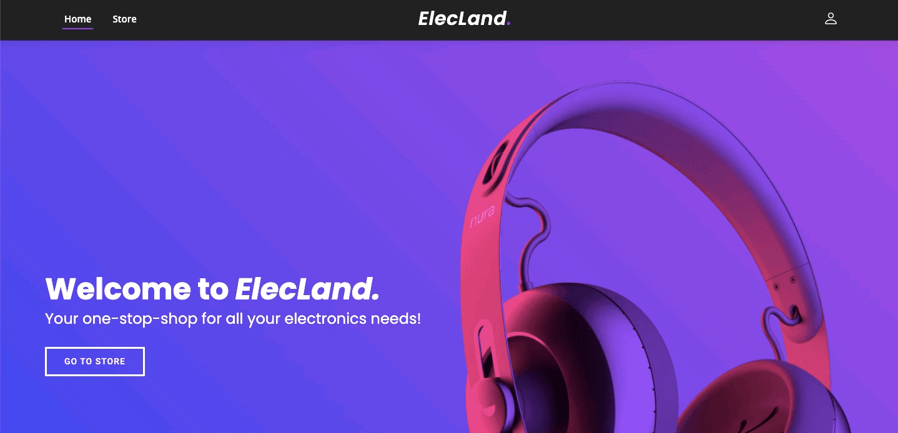
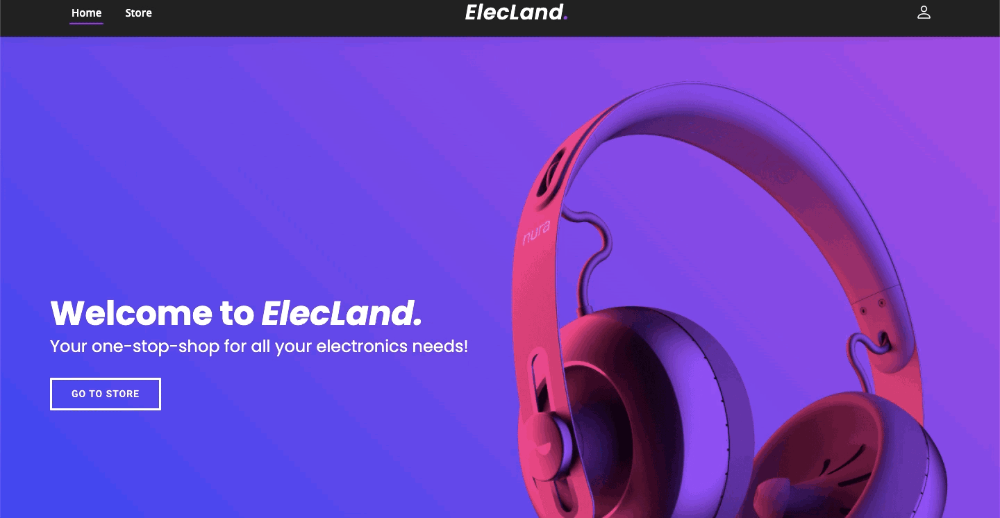
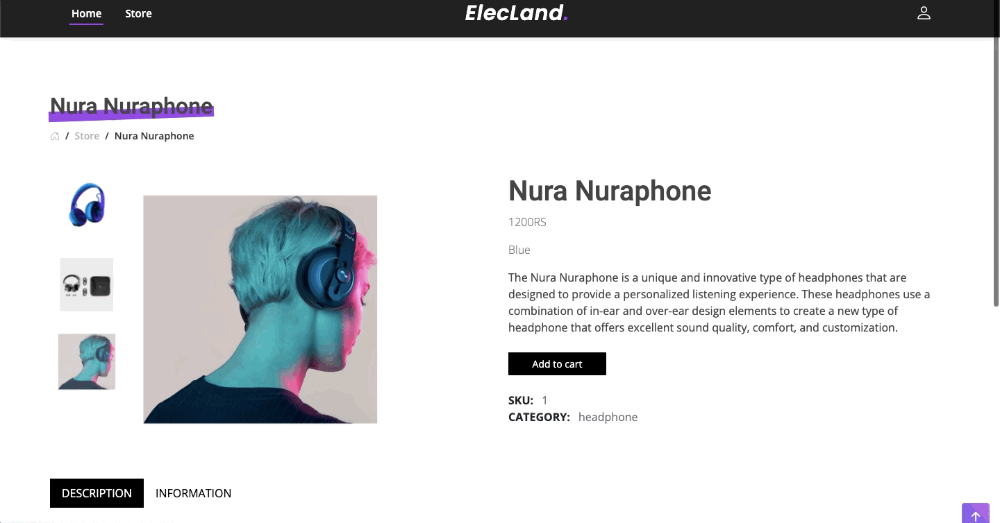
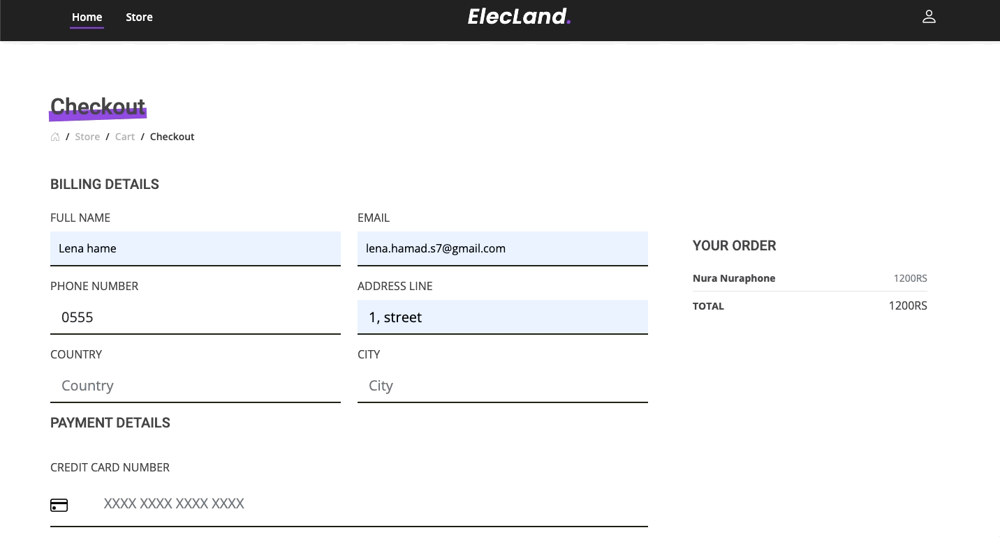
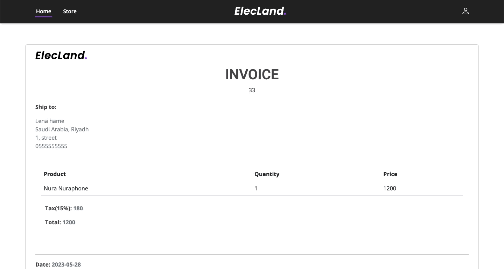

<!-- PROJECT LOGO -->
<div align="center">
  <a href="https://github.com/4lena/ElecLand">
    
  </a>
</div>

<!-- TABLE OF CONTENTS -->
<details>
  <summary>Table of Contents</summary>
  <ol>
    <li>
      <a href="#about-the-project">About The Project</a>
    </li>
    <li>
      <a href="#built-with">Built With</a>
    </li>
    <li>
      <a href="#main-features">Main Features</a>
    </li>
    <li>  
      <a href="#getting-started">Getting Started</a>
      <ul>
        <li><a href="#prerequisites">Prerequisites</a></li>
        <li><a href="#installation">Installation</a></li>
      </ul>
    </li>
  </ol>
</details>

<!-- introduction -->
## About The Project

ElecLand is an E-commerce website that specializes in selling a wide range of electronic products. The website 
provides users with a seamless shopping experience that allows them to browse various products, view product details, 
add products to their cart, checkout, and see the invoice. Furthermore, ElecLand provides an authentic feature where users can sign up for an 
account on ElecLand or sign in if they already have an account.

<!-- technology -->
## Built With

* [](https://skills.thijs.gg)
* [](https://skills.thijs.gg)
* [](https://skills.thijs.gg)

<!-- technology -->
## Main Features

### Home Page
<div align="center">
  
</div>
On the home page users can navigate through the about us, top products, categories, and our features sections.

---

### Registration
<div align="center">
  
</div>
To register, users can click on the register button located on the drop-down menu on the right corner of the page. Then fill out the registration form.

---

### Login 
<div align="center">
  
</div>
To login, users can click on the login button located on the drop-down menu on the right corner of the page. Then fill out the registration form.

---

### Validation
<div align="center">
  
</div>
Before allowing users to submit their input, the system validates it for accuracy.

---

### Logout
<div align="center">
  
</div>
Users can logout.

---

### Store Page
<div align="center">
  
</div>
Users can view all products on the store page and filter them by category using the category buttons.

---

### Product details
<div align="center">
  
</div>
Users can view the product details by clicking on it.

---

### Add to Cart
<div align="center">
  
</div>
Users can add a product to their cart by clicking the 'Add to Cart' button. They will then be redirected to the cart page, where they can choose to continue shopping or proceed to checkout.

---

### Checkout 
<div align="center">
  
</div>
To complete the purchase, users must fill out the billing and payment forms on the checkout page.

---

### Invoice 
<div align="center">
  
</div>
After checking out, users will be redirected to the invoice page.

---

<!-- GETTING STARTED -->
## Getting Started


### Prerequisites 

* PHP
* Laravel
* MySQL
* Composer

### Installation

1. Clone the repository to your local machine using Git.
```sh
git clone https://github.com/your-username/your-repo.git
```
2. Navigate to the project directory:
```sh
cd your-repo
```
3. Install the project's dependencies using Composer:
```sh
composer install
```
4. Create a new MySQL database for the project:
```sh
mysql -u root -p
CREATE DATABASE your_database_name;
```

5. Update the .env file with your database credentials:

6. Generate a new application key:
```sh
php artisan key:generate
```

7. Run the database migrations to create the necessary tables:
```sh
php artisan migrate
```

8. Seed the database with sample data:
```sh
php artisan db:seed
```

9. Start the development server:
```sh
php artisan serve
```
